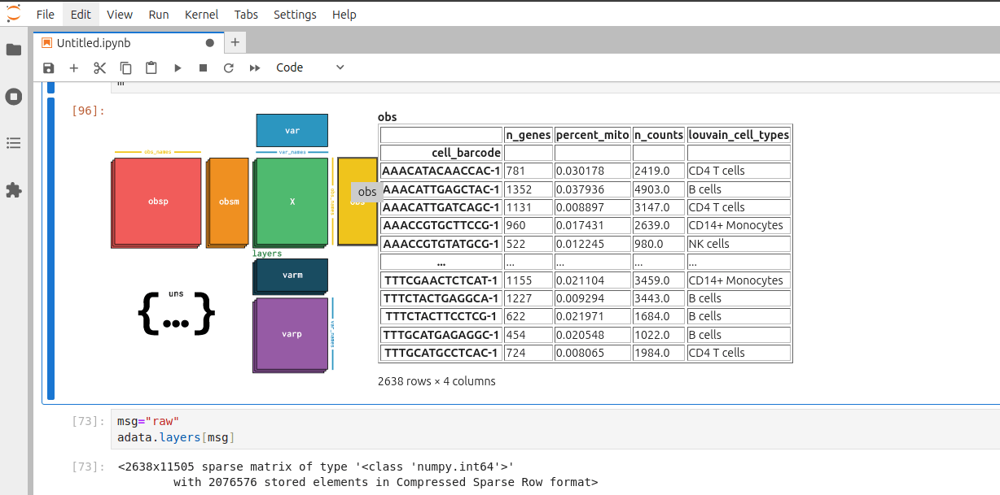

# anndata-inspector

A scverse hackathon 2024 project to interactively inspect anndata objects

## Screenshot

## Footnote

See also https://github.com/manzt/anndata-repr

This repo uses `anywidget` and has more dependencies while anndata-repr aims to be more static and self-contained
